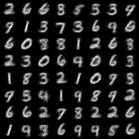

[](https://www.python.org/downloads/)
[](https://github.com/braun-steven/simple-einet/blob/main/LICENSE.md)
[](https://black.readthedocs.io/en/stable/)


# An EinsumNetworks Implementation

This repository contains code for my personal EinsumNetworks implementation. 

For a speed benchmark comparison against the official [EinsumNetworks](https://github.com/cambridge-mlg/EinsumNetworks) implementation, check out [benchmark.md](./benchmark/benchmark.md) (TLDR:  simple-einet is faster in all dimensions except the input-channel size in which it scales similar to the official EinsumNetworks implementation).

## Notebooks

The `notebooks` directory contains Jupyter notebooks that demonstrate the usage of this library.

- [Training a discriminative Einet the iris dataset](./notebooks/iris_classification.ipynb)
- [Training a generative Einet on MNIST](./notebooks/mnist.ipynb)
- [Training an Einet on synthetic multivariate Normal data](./notebooks/multivariate_normal.ipynb)

## PyTorch Lightning Training

The `main_pl.py` script offers PyTorch-Lightning based training for discriminative and generative Einets.

Classification on MNIST examples:

```sh
python main_pl.py dataset=mnist batch_size=128 epochs=100 dist=normal D=5 I=32 S=32 R=8 lr=0.001 gpu=0 classification=true 
```


Generative training on MNIST:

``` sh
python main_pl.py dataset=mnist D=5 I=16 R=10 S=16 lr=0.1 dist=binomial epochs=10 batch_size=128
```



## Installation

You can install `simple-einet` as a dependency in your project as follows:

```sh
pip install git+https://github.com/braun-steven/simple-einet

```

If you want to additionally install the dependencies requires to launch the provided scripts such as `main.py`, `main_pl.py` or the notebooks, run

```
pip install "git+https://github.com/braun-steven/simple-einet#egg=simple-einet[app]"
```

If you plan to edit the files after installation:
```
git clone git@github.com:braun-steven/simple-einet.git
cd simple-einet
pip install -e .
```


## Usage Example

The following is a simple usage example of how to create, optimize, and sample from an Einet.

```python
import torch
from simple_einet.layers.distributions.normal import Normal
from simple_einet.einet import Einet
from simple_einet.einet import EinetConfig


if __name__ == "__main__":
    torch.manual_seed(0)

    # Input dimensions
    in_features = 4
    batchsize = 5

    # Create input sample
    x = torch.randn(batchsize, in_features)

    # Construct Einet
    cfg = EinetConfig(
        num_features=in_features,
        depth=2,
        num_sums=2,
        num_channels=1,
        num_leaves=3,
        num_repetitions=3,
        num_classes=1,
        dropout=0.0,
        leaf_type=Normal,
    )
    einet = Einet(cfg)

    # Compute log-likelihoods
    lls = einet(x)
    print(f"lls.shape: {lls.shape}")
    print(f"lls: \n{lls}")

    # Optimize Einet parameters (weights and leaf params)
    optim = torch.optim.Adam(einet.parameters(), lr=0.001)

    for _ in range(1000):
        optim.zero_grad()

        # Forward pass: compute log-likelihoods
        lls = einet(x)

        # Backprop negative log-likelihood loss
        nlls = -1 * lls.sum()
        nlls.backward()

        # Update weights
        optim.step()

    # Construct samples
    samples = einet.sample(2)
    print(f"samples.shape: {samples.shape}")
    print(f"samples: \n{samples}")
```

## Citing EinsumNetworks

If you use this software, please cite it as below.

```bibtex
@software{braun2021simple-einet,
author = {Braun, Steven},
title = {{Simple-einet: An EinsumNetworks Implementation}},
url = {https://github.com/braun-steven/simple-einet},
version = {0.0.1},
}
```

If you use EinsumNetworks as a model in your publications, please cite our official EinsumNetworks paper.

```bibtex
@inproceedings{pmlr-v119-peharz20a,
  title = {Einsum Networks: Fast and Scalable Learning of Tractable Probabilistic Circuits},
  author = {Peharz, Robert and Lang, Steven and Vergari, Antonio and Stelzner, Karl and Molina, Alejandro and Trapp, Martin and Van Den Broeck, Guy and Kersting, Kristian and Ghahramani, Zoubin},
  booktitle = {Proceedings of the 37th International Conference on Machine Learning},
  pages = {7563--7574},
  year = {2020},
  editor = {III, Hal Daumé and Singh, Aarti},
  volume = {119},
  series = {Proceedings of Machine Learning Research},
  month = {13--18 Jul},
  publisher = {PMLR},
  pdf = {http://proceedings.mlr.press/v119/peharz20a/peharz20a.pdf},
  url = {http://proceedings.mlr.press/v119/peharz20a.html},
  code = {https://github.com/cambridge-mlg/EinsumNetworks},
}
```
